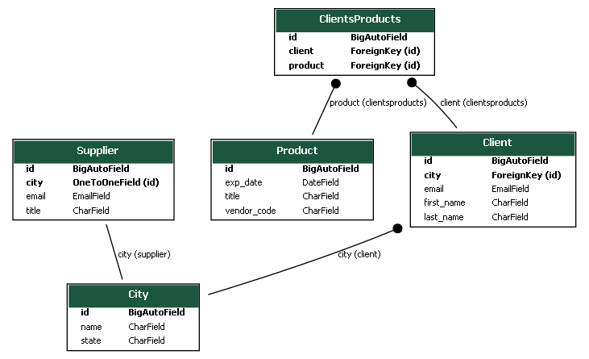

# Hillel_Django_HW2
Django homework for Hillel IT school. 

# Quick start 

Assuming you have Python setup, run the following commands 
(if you're on Windows you may use py or py -3 instead of python to start Python):
* pip3 install -r dev-requirements.txt
* python3 manage.py migrate
* python3 manage.py runserver

Open tab to http://127.0.0.1:8000 to see the main site

# Catalog app

* Custom management commands:
  - python3 manage.py create_users {number from 1-10}
  - python3 manage.py delete_users {list of user ids to be deleted} (1 2 5) Except superuser

* Load fixtures
  -  python3 manage.py loaddata fixtures-catalog.json --app catalog

# Triangle app
* Load fixtures
  - python3 manage.py loaddata fixtures-triangle.json --app triangle
